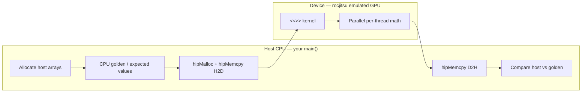

# rocjitsu Usage Examples

Comprehensive examples for debugging ROCm workloads using rocjitsu emulation.

## Overview

Each example is self-contained with:
- **README.md** - Debugging objectives and instructions
- **Source code** - Complete working examples
- **Makefile** - Build and run commands
- **Expected output** - What to look for

## In-depth debugging guides

### Common HIP pattern (all C++ examples)



rocjitsu sits on the **host** and intercepts HIP APIs; kernels still run as if on
a GPU, but execution is simulated. **CPU golden** is always computed on the host
and is not sent to the device unless you copy it.

Each example has a detailed **`GUIDE.md`** (objectives, **host vs device diagrams**,
rocjitsu workflow, tools, expected output, limitations):

| Example | Guide |
|---------|-------|
| [01-vector-add-basic](01-vector-add-basic/GUIDE.md) | Kernel launch, golden verification, `RJ_LOG=1` |
| [02-memory-bounds-error](02-memory-bounds-error/GUIDE.md) | Out-of-bounds writes, launch geometry |
| [03-kernel-crash-debug](03-kernel-crash-debug/GUIDE.md) | NULL pointer — host validation (emulator may not fault) |
| [04-data-race-simple](04-data-race-simple/GUIDE.md) | Histogram race, `RJ_RACE=1` |
| [05-global-memory-race](05-global-memory-race/GUIDE.md) | Global reduction race, atomics |
| [06-memory-coalescing](06-memory-coalescing/GUIDE.md) | Strided vs coalesced access, profiling |
| [07-occupancy-analysis](07-occupancy-analysis/GUIDE.md) | Block size / register pressure |
| [08-gemm-debugging](08-gemm-debugging/GUIDE.md) | Tiny GEMM golden check |
| [09-pytorch-model-debug](09-pytorch-model-debug/GUIDE.md) | PyTorch daemon mode, training smoke |
| [10-multi-gpu-collective](10-multi-gpu-collective/GUIDE.md) | 2-GPU config, daemon, RCCL path |
| [11-dbt-cross-arch](11-dbt-cross-arch/GUIDE.md) | DBT gfx950→gfx942 |

## Examples by Category

### 🚀 Getting Started (Basic Debugging)

| Example | Description | Key Learning | Files |
|---------|-------------|--------------|-------|
| [01-vector-add-basic](01-vector-add-basic/) | Simple vector addition | Kernel launch, memory transfers, verification | `vector_add.cpp`, `Makefile` |
| [02-memory-bounds-error](02-memory-bounds-error/) | Out-of-bounds detection | Buffer overruns, memory safety | `bounds_error.cpp`, `bounds_fixed.cpp`, `Makefile` |
| [03-kernel-crash-debug](03-kernel-crash-debug/) | Invalid device pointers | NULL ptr, host validation, sim vs hardware | `crash_example.cpp`, `crash_fixed.cpp`, `Makefile` |

### 🔍 Race Detection

| Example | Description | Key Learning | Files |
|---------|-------------|--------------|-------|
| [04-data-race-simple](04-data-race-simple/) | Simple data races | Race detector, atomics, histogram | `histogram_race.cpp`, `histogram_fixed.cpp`, `Makefile` |
| [05-global-memory-race](05-global-memory-race/) | Global memory races | Multi-block synchronization, reduction | `global_race.cpp`, `global_fixed.cpp`, `Makefile` |

### ⚡ Performance Analysis

| Example | Description | Key Learning | Files |
|---------|-------------|--------------|-------|
| [06-memory-coalescing](06-memory-coalescing/) | Memory access patterns | Coalesced vs strided access, bandwidth | `memory_pattern.cpp`, `Makefile` |
| [07-occupancy-analysis](07-occupancy-analysis/) | Kernel occupancy | Register/shared memory usage, block sizing | `occupancy.cpp`, `Makefile` |

### 🎯 Advanced Examples

| Example | Description | Key Learning | Files |
|---------|-------------|--------------|-------|
| [08-gemm-debugging](08-gemm-debugging/) | Matrix multiplication | GEMM correctness, numerical accuracy | `gemm_test.cpp`, `Makefile` |
| [09-pytorch-model-debug](09-pytorch-model-debug/) | PyTorch models | Daemon mode, gradient checking, NaN debugging | `simple_model.py`, `Makefile` |
| [10-multi-gpu-collective](10-multi-gpu-collective/) | RCCL collectives | Multi-GPU, 2-GPU config, distributed ops | `multi_gpu.cpp`, `Makefile` |

### 🔄 Cross-Architecture Translation

| Example | Description | Key Learning | Files |
|---------|-------------|--------------|-------|
| [11-dbt-cross-arch](11-dbt-cross-arch/) | Dynamic Binary Translation | CDNA4→CDNA3 translation, ISA compatibility | `dbt_example.cpp`, `Makefile` |

## Quick Start

### Option 1: Docker Setup (Recommended for Beginners)

The easiest way to get started is using the provided Docker setup script:

```bash
# Navigate to rocjitsu directory
cd emulation/rocjitsu

# Run the Docker setup script
./setup_rocjitsu_docker.sh
```

**What this script does:**
1. Pulls the `rocm/pytorch:latest` Docker image (includes ROCm, hipcc, and PyTorch)
2. Checks if the image already contains rocjitsu (or builds it from source)
3. Creates a persistent Docker container named `rocjitsu-dev`
4. Mounts your workspace at `/workspace` in the container
5. Compiles `hip_vector_add_test` example
6. Runs tests to verify everything works
7. Provides helpful commands for future use

**After setup, run examples in Docker:**

```bash
# Enter the Docker container
docker exec -it rocjitsu-dev bash

# Inside container, navigate to examples
cd /workspace/emulation/rocjitsu/usage-examples/01-vector-add-basic

# Build and run
make
make run
```

**The container persists across sessions:**
```bash
# Stop the container
docker stop rocjitsu-dev

# Start it again later
docker start rocjitsu-dev
docker exec -it rocjitsu-dev bash

# Remove when done
docker rm -f rocjitsu-dev
```

### Option 2: Native Setup

If you prefer to build and run natively (without Docker):

```bash
# 1. Build rocjitsu
cd emulation/rocjitsu
cmake -B build -G Ninja -DCMAKE_BUILD_TYPE=Release
cmake --build build
export PATH=$PWD/build/tools/rocjitsu:$PATH

# 2. Navigate to an example
cd usage-examples/01-vector-add-basic

# 3. Build and run
make
make run
```

### Running Pattern

All examples follow the same pattern:

```bash
# Build
make              # or 'make build'

# Run basic version
make run

# Run with logging
make run-verbose  # or 'make run-debug'

# Clean up
make clean

# See all options
make help
```

## Requirements

### Using Docker (Recommended)
- Docker Desktop or Docker Engine
- `setup_rocjitsu_docker.sh` script (included in `emulation/rocjitsu/`)
- Everything else (ROCm, hipcc, PyTorch) is included in the Docker image

### Native Setup
- CMake 3.22+
- C++20 compiler (GCC 13+ or Clang 16+)
- ROCm installation (for HIP examples)
- hipcc compiler (for GPU kernels)
- rocjitsu built and in PATH

## Directory Structure

Each example follows this structure:

```
example-name/
├── README.md          # Objectives, usage, expected output
├── Makefile           # Build and run commands
├── src/
│   ├── main.cpp       # Host code
│   └── kernel.hip     # GPU kernel (if applicable)
└── expected-output/   # Sample output files (optional)
    └── output.txt
```

## Common Makefile Targets

Every example includes these targets:

| Target | Description |
|--------|-------------|
| `make` or `make build` | Compile the example |
| `make run` | Run through rocjitsu (basic mode) |
| `make run-verbose` | Run with `RJ_LOG=1` |
| `make run-daemon` | Run in daemon mode |
| `make clean` | Remove build artifacts |
| `make help` | Show all available targets |

## Environment Variables Reference

### Logging and Debugging

```bash
# Enable verbose logging
RJ_LOG=1 make run

# Enable race detection (correct flag)
RJ_RACE=1 make run

# Write logs to file
RJ_SINKS=file RJ_SINK_DIR=./logs make run

# Multiple sinks
RJ_SINKS=race_detector,file RJ_SINK_DIR=./logs make run
```

### Performance and Profiling

```bash
# Enable profiling
RJ_USE_PROFILED_EXECUTION_PLUGIN_GROUP=1 RJ_SINKS=file make run

# Specify runtime directory
ROCJITSU_RUNTIME_DIR=/tmp/rocjitsu make run
```

### Dynamic Binary Translation

```bash
# Enable DBT with logging
RJ_DBT_LOG=1 make run

# Set target ISA
RJ_DBT_TARGET_ISA=gfx942 make run
```

## Learning Path

### Beginner
1. Start with [01-vector-add-basic](01-vector-add-basic/) - Learn the basics
2. Try [04-data-race-simple](04-data-race-simple/) - Understand race detection
3. Explore [09-pytorch-model-debug](09-pytorch-model-debug/) - Real-world ML debugging

### Intermediate
4. Study [06-memory-coalescing](06-memory-coalescing/) - Optimize memory access
5. Learn [08-gemm-debugging](08-gemm-debugging/) - Work with rocBLAS
6. Practice [05-global-memory-race](05-global-memory-race/) - Complex race patterns

### Advanced
7. Master [10-multi-gpu-collective](10-multi-gpu-collective/) - Multi-GPU debugging
8. Experiment [11-dbt-cross-arch](11-dbt-cross-arch/) - Cross-architecture translation
9. Combine techniques - Debug your own applications

## Configuration Files

All examples use JSON configuration files from `../../configs/`:

| Config File | Description | GPU |
|-------------|-------------|-----|
| `amdgpu_cdna4_kmd.json` | Single CDNA4 GPU | gfx950 |
| `amdgpu_cdna4_kmd_2gpu.json` | Dual CDNA4 GPUs | gfx950 |
| `amdgpu_cdna3_kmd.json` | CDNA3 GPU | gfx942 |
| `amdgpu_cdna2_kmd.json` | CDNA2 GPU | gfx90a |

Example usage:
```bash
# Use CDNA3 config
make run CONFIG=../../configs/amdgpu_cdna3_kmd.json
```

## Troubleshooting

### Docker-specific issues

```bash
# Docker not found
# Solution: Install Docker Desktop or ensure docker is in PATH
export PATH="$PATH:/c/Program Files/Docker/Docker/resources/bin"

# Container already exists
# The script will reuse existing container - no action needed
# To start fresh:
docker rm -f rocjitsu-dev
./setup_rocjitsu_docker.sh

# Permission issues on Windows
# Run the script in Git Bash or WSL, not cmd.exe or PowerShell

# Enter container for debugging
docker exec -it rocjitsu-dev bash
cd /workspace/emulation/rocjitsu
```

### Example won't build

```bash
# Check hipcc is available
which hipcc

# Verify rocjitsu is built
ls ../../build/tools/rocjitsu/rocjitsu

# Check Makefile paths
make help

# In Docker, ensure you're in the container
docker exec -it rocjitsu-dev bash
cd /workspace/emulation/rocjitsu/usage-examples
```

### Example crashes

```bash
# Run with logging
RJ_LOG=1 make run

# Check for races
RJ_RACE=1 make run

# Use verbose output
make run-verbose 2>&1 | tee output.log
```

### Incorrect results

```bash
# Enable race detector
RJ_SINKS=race_detector make run

# Check numerical precision
# Review the README for that specific example
```

## Getting Help

### Documentation
- [rocjitsu Main Docs](../docs/) - Full technical documentation
- [Building Guide](../docs/building.md) - Build instructions
- [CLI Reference](../docs/rocjitsu-cli.md) - Command-line options
- [Configuration Guide](../docs/configuration.md) - Config file format
- [Race Detector Guide](../docs/race-detector.md) - Race detection details

### Example-Specific Help

Each example includes:
- **README.md** - Detailed objectives and instructions
- **Expected output** - What to look for
- **Common issues** - Debugging tips
- **Exercises** - Practice problems

### Community
- [GitHub Issues](https://github.com/ROCm/rocm-systems/issues)
- [ROCm Documentation](https://rocm.docs.amd.com/)

## Contributing

To add a new example:

1. Create a new directory: `NN-example-name/`
2. Include:
   - `README.md` - Objectives, instructions, expected output
   - `src/` - Source code
   - `Makefile` - Build and run commands
   - `expected-output/` - Sample outputs (optional)
3. Follow the existing structure and naming
4. Update this README.md with your example
5. Submit a pull request

## Summary

These examples provide hands-on experience with:
- ✅ Basic GPU debugging workflows
- ✅ Race condition detection and fixing
- ✅ Performance profiling and optimization
- ✅ Real-world application debugging (PyTorch, rocBLAS)
- ✅ Multi-GPU and distributed debugging
- ✅ Cross-architecture translation

Start with the basics and progress to advanced examples as you build expertise with rocjitsu!